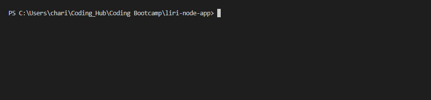

# liri-node-app

Liri is your answer to all your entertainment curiosity needs;
can't remember what Album that song is from? Liri it!
want to find out your favorite band's upcoming concerts? Liri it!
want to know what actors were in that movie you just watched? Liri it!

Liri is a Language Interpetation and Recognition Interface Application with a Terminal based UI. 
Its primary goals are to take user input and output music, concerts, and movies depending on the user's submission.
Packages Used:
Axios: make requests for Spotify, Bands in Town, and OMDB API's
File Systems: for some light file reading
Moment: date formatting
dotenv: security of API keys.

I dev'ed everythang

Demo:
